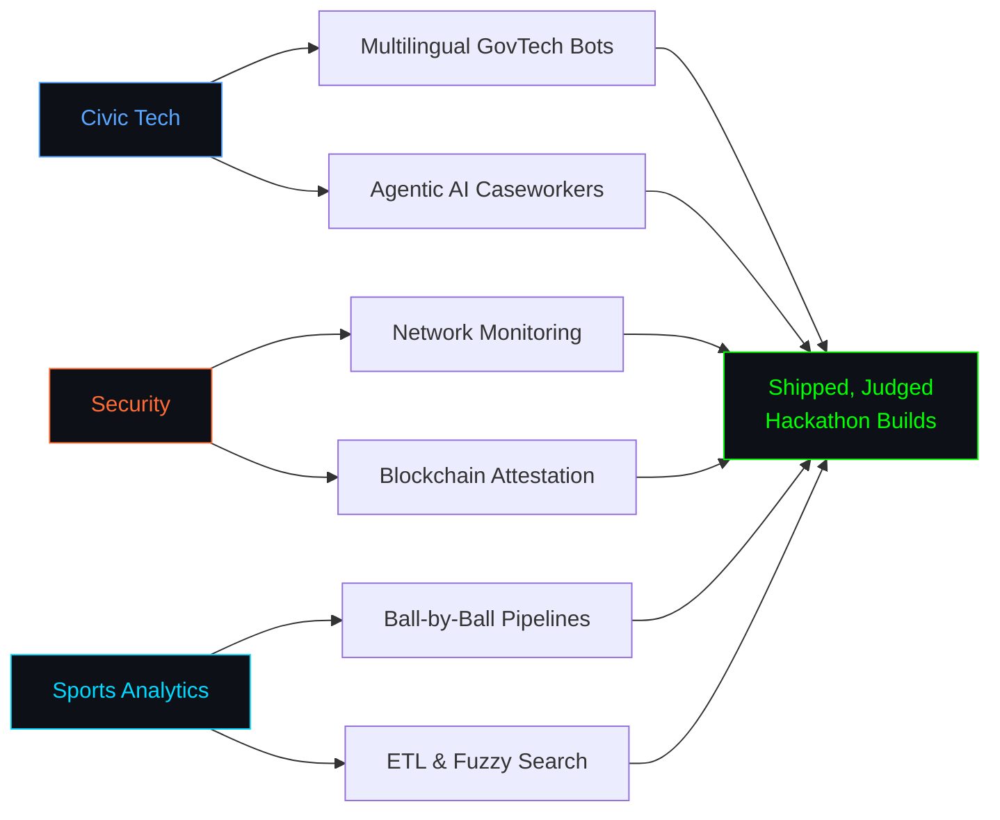
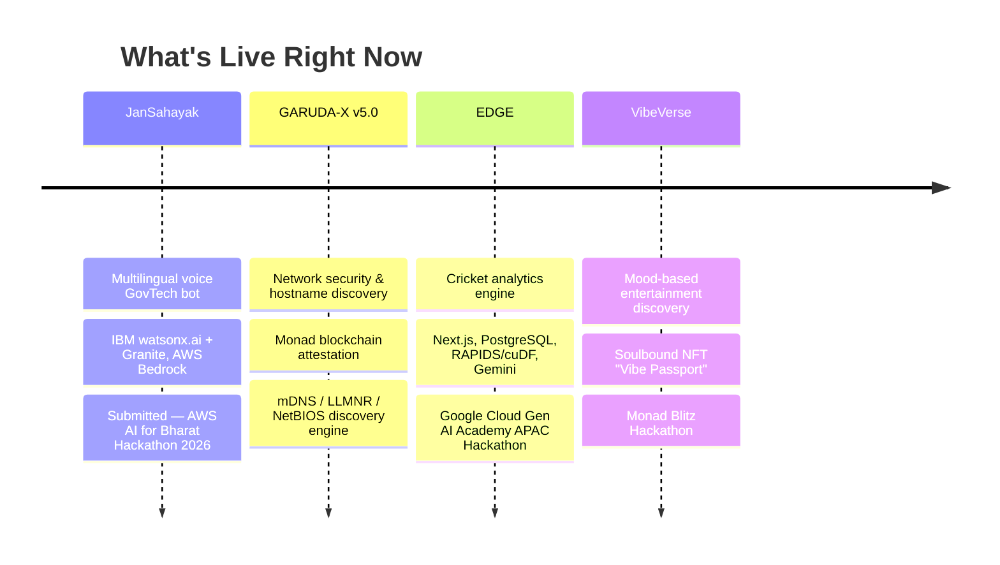

<div align="center">


<h1>Vudatha Dhruva Sai</h1>


<!-- Requires the Platane/snk GitHub Action set up on the DHRUVASAI/DHRUVASAI repo -->


</div>


```python
class DhruvaSai:
    def __init__(self):
        self.name = "Vudatha Dhruva Sai"
        self.role = ["AI/ML Builder", "Cloud Tinkerer", "CS Undergrad"]
        self.education = "B.Tech CSE — KL University (KLEF), Hyderabad · Class of 2028"
        self.cgpa = 9.28
        self.location = "Hyderabad, India"

    def tech(self):
        return {
            "languages": ["Python", "TypeScript", "C", "HTML5", "CSS3", "Solidity"],
            "ai_cloud": ["IBM watsonx.ai", "IBM Granite", "AWS Bedrock", "Google Cloud", "Gemini", "Llama 3.x"],
            "backend": ["FastAPI", "Flask", "Node.js", "Express.js", "Prisma"],
            "frontend": ["Next.js", "React", "Vite", "Tailwind CSS"],
            "data": ["PostgreSQL", "Supabase", "Firebase", "Pandas", "NumPy", "scikit-learn"],
        }

me = DhruvaSai()
```

```
CS undergrad who leans on AI-assisted tooling to build fast — from agentic
GovTech bots that help rural citizens claim welfare benefits, to network
security dashboards, to cricket analytics pipelines crunching 800K+
deliveries. I ship end to end: schema to backend to pitch deck.
```


<div align="center">

## Tech Stack


<br>


<br>


</div>


<div align="center">

## Focus Areas

</div>




<div align="center">

## Currently Building

</div>




<div align="center">

## Open to Collaboration

<table width="100%">
<tr>
<td align="center" width="25%">
  <picture>
    <source media="(prefers-color-scheme: dark)" srcset="https://api.iconify.design/mdi/account-voice.svg?color=white">
    <source media="(prefers-color-scheme: light)" srcset="https://api.iconify.design/mdi/account-voice.svg?color=black">
    
  </picture>
  <br><br>
  <strong>Civic / GovTech</strong>
  <br><br>
  <small>
    Agentic AI Caseworkers<br>
    Multilingual Access<br>
    Public Impact Tools
  </small>
</td>
<td align="center" width="25%">
  <picture>
    <source media="(prefers-color-scheme: dark)" srcset="https://api.iconify.design/mdi/shield-lock-outline.svg?color=white">
    <source media="(prefers-color-scheme: light)" srcset="https://api.iconify.design/mdi/shield-lock-outline.svg?color=black">
    
  </picture>
  <br><br>
  <strong>Security & Web3</strong>
  <br><br>
  <small>
    Network Monitoring<br>
    Blockchain Attestation<br>
    Smart Contracts
  </small>
</td>
<td align="center" width="25%">
  <picture>
    <source media="(prefers-color-scheme: dark)" srcset="https://api.iconify.design/mdi/cricket.svg?color=white">
    <source media="(prefers-color-scheme: light)" srcset="https://api.iconify.design/mdi/cricket.svg?color=black">
    
  </picture>
  <br><br>
  <strong>Sports Analytics</strong>
  <br><br>
  <small>
    Ball-by-Ball Pipelines<br>
    ETL & Caching<br>
    Data-Driven Insight
  </small>
</td>
<td align="center" width="25%">
  <picture>
    <source media="(prefers-color-scheme: dark)" srcset="https://api.iconify.design/mdi/robot-outline.svg?color=white">
    <source media="(prefers-color-scheme: light)" srcset="https://api.iconify.design/mdi/robot-outline.svg?color=black">
    
  </picture>
  <br><br>
  <strong>Applied AI</strong>
  <br><br>
  <small>
    Agentic Systems<br>
    LLM Pipelines<br>
    ML Classifiers
  </small>
</td>
</tr>
</table>

</div>


<div align="center">

<picture>
  <source media="(prefers-color-scheme: dark)" srcset="https://github-readme-activity-graph.vercel.app/graph?username=DHRUVASAI&theme=tokyo-night&hide_border=true&bg_color=0D1117&color=00D9FF&line=00D9FF&point=FF6B35&area=true"/>
  
</picture>

<picture>
  <source media="(prefers-color-scheme: dark)" srcset="https://github-readme-stats.vercel.app/api?username=DHRUVASAI&show_icons=true&include_all_commits=true&count_private=true&theme=tokyonight&hide_border=true&bg_color=0D1117&title_color=00D9FF&text_color=FFFFFF&icon_color=FF6B35&cache_bust=1"/>
  
</picture>

<picture>
  <source media="(prefers-color-scheme: dark)" srcset="https://github-readme-stats.vercel.app/api/top-langs/?username=DHRUVASAI&layout=compact&theme=tokyonight&hide_border=true&bg_color=0D1117&title_color=00D9FF&text_color=FFFFFF&langs_count=10&cache_bust=1"/>
  
</picture>

</div>


<div align="center">

<i>"Build things that matter."</i>

<br><br>

[](https://www.linkedin.com/in/vudatha-dhruva-sai-500217315/)
[](mailto:dhruvasai1706@gmail.com)
[](https://github.com/DHRUVASAI)

<br>


</div>
