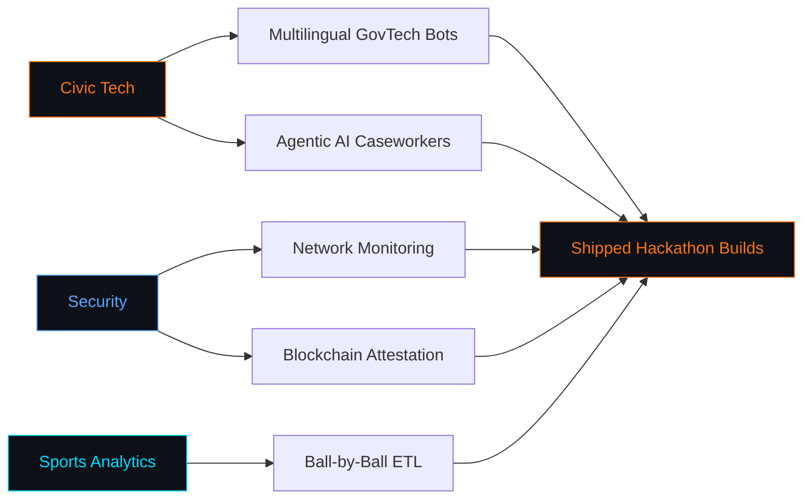

# 👋 Vudatha Dhruva Sai

**B.Tech Computer Science & Technology · KL University (KLEF), Hyderabad · Class of 2028**

## 🧠 What I'm Building

> **JanSahayak** — an agentic AI caseworker that lets rural Indians apply for government schemes by voice, in their language, in 3 minutes. No typing. No English. No office visits.
>
> Powered by **IBM watsonx.ai** and the **Granite** foundation model family, with **IBM Cloud Object Storage** securing every document in the pipeline.
>
> 🏆 Submitted to **AWS AI for Bharat Hackathon 2026** · Track: AI for Communities, Access & Public Impact

Alongside that: **GARUDA-X v5.0** (network security + Monad blockchain attestation) and **EDGE** (cricket analytics crunching 800K+ deliveries), both built for live hackathons rather than left as side projects.

---

## Focus Areas

---

## 💻 Tech Stack

### ☁️ Cloud & AI

### 🧑‍💻 Languages & Frameworks

### 📊 Data & ML

---

## Open to Collaboration

<table width="100%">
<tr>
<td align="center" width="25%">
    
  <strong>Civic / GovTech</strong>  
  <small>Agentic Caseworkers Multilingual Access</small>
</td>
<td align="center" width="25%">
    
  <strong>Security & Web3</strong>  
  <small>Network Monitoring Blockchain Attestation</small>
</td>
<td align="center" width="25%">
    
  <strong>Sports Analytics</strong>  
  <small>Ball-by-Ball Pipelines ETL & Caching</small>
</td>
<td align="center" width="25%">
    
  <strong>Applied AI</strong>  
  <small>Agentic Systems ML Classifiers</small>
</td>
</tr>
</table>

---

## 📊 GitHub Stats

<picture>
  <source media="(prefers-color-scheme: dark)" srcset="https://github-readme-stats.vercel.app/api/top-langs/?username=DHRUVASAI&layout=compact&theme=tokyonight&hide_border=true&bg_color=0D1117&title_color=F97316&langs_count=10"/>
  
</picture>

---

## 🌱 Currently

- 🔭 Building **JanSahayak** — agentic AI for rural welfare access, powered by **IBM watsonx.ai** and **Granite**
- 📚 Deep diving into **cloud architecture** (AWS + IBM Cloud) and **LLM pipelines**
- 🤝 Open to collaborations on **AI for social impact** projects

---

## 📫 Let's Connect

 

<i>"Build things that matter."</i>

